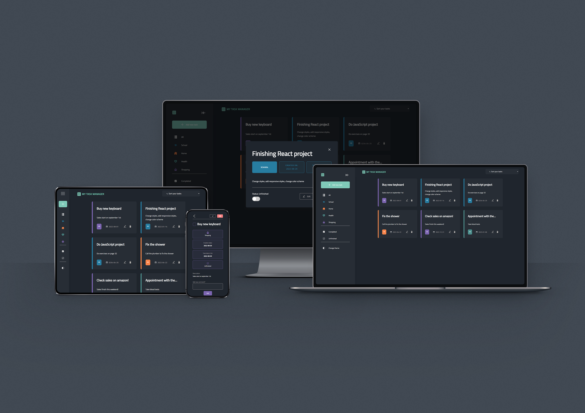
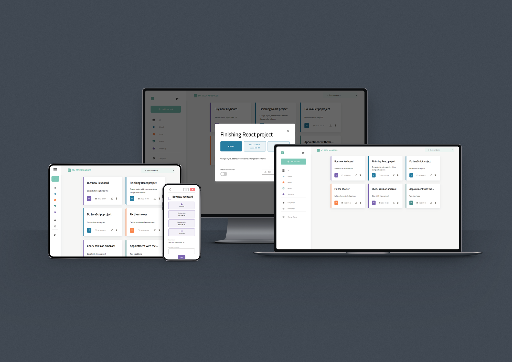

# My Task Manager

This project was bootstrapped with [Create React App](https://github.com/facebook/create-react-app).

## Installation and Setup Instructions

### `npm install`
Downloads a package and it's dependencies used in the project

### `npm start`

Runs the app in the development mode.\
Open [http://localhost:3000](http://localhost:3000) to view it in the browser.

The page will reload if you make edits.\
You will also see any lint errors in the console.

### `localhost:3000`

To view the app in the browser

## Libraries used in the project

[Animate On Scroll](https://github.com/michalsnik/aos) \
[React Hook Form](https://react-hook-form.com/)
